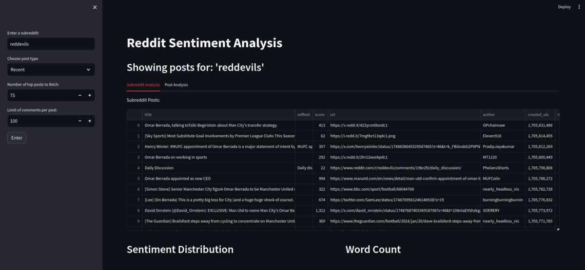

# reddit-project

# Project Summary

Allows users to search for a subreddit then produces a sentiment dashboard of of the ovrall subreddit and posts within them. Users can choose a post, and get a sentiment dashboard of that post. Built using streamlit.

# Screenshots



# Data and Storage

Data is fetched using `praw`.

Post data structure design:
```python
comments = []
comment_data = {
    'body': comment.body,
    'author': str(comment.author),
    'score': comment.score,
    'created_utc': comment.created_utc,
    'is_top_level': comment.is_root,
    'parent_id': comment.parent_id,
    'depth': comment.depth,
    'gilded': comment.gilded
    }
comments.append(comment_data)

post_data = {
    'title': post.title,
    'selftext': post.selftext,
    'score': post.score,
    'url': post.url,
    'author': str(post.author),
    'created_utc': post.created_utc,
    'num_comments': post.num_comments,
    'upvote_ratio': post.upvote_ratio,
    'subreddit': str(post.subreddit),
    'comments': comments
}
```

# Text Preprocessing 

Text preprocessing is a critical step in NLP (Natural Language Processing). It involves transforming raw text into a more analyzable and uniform format. This process is crucial for improving the performance of machine learning models and to understand the data better.

This section covers the text preprocesssing steps taken for this project. 

## Libaries Used:

- `re`: For regular expression operations.
- `string`: For string manipulation tasks.
- `nltk`:  Ued for a  of text processing tasks like tokenization and stopwords removal.
- `contractions`: Used to handle the expansion of contractions in English text.
- `emoji`: For converting emojis into text.
- `spacy`: Used here for lemmatization.


## 1. Expand Contractions
- **Function**: `expand_contractions`
- **Purpose**: Converts contractions (e.g., "can't", "won't") to their expanded forms (e.g., "cannot", "will not").
- **Why**: This standardizes text and aids in accurate word tokenization and analysis.

## 2. Replace Emoji
- **Function**: `replace_emoji`
- **Purpose**: Transforms emojis into corresponding text descriptions.
- **Why**: People use Emojis all the time and it would be a shame to not make use of them. This function enables the processing of emotional content represented by emojis, which is otherwise lost in text-only analysis.

## 3. Lowercase Text
- **Function**: `lowercase_text`
- **Purpose**: Converts all text to lowercase.
- **Why**: Ensures uniformity in text, removing case sensitivity from the analysis.

## 4. Removing Punctuation
- **Function**: `remove_punctuation`
- **Purpose**: Eliminates punctuation marks from the text.
- **Why**: Simplifies the text and removes unnecessary characters that might skew word frequencies or tokenization.

## 7. Remove Numbers
- **Function**: `remove_numbers`
- **Purpose**: Strips away all numeric characters.
- **Why**: Focuses analysis on textual content, especially when numbers are irrelevant to the context.

## 7. Remove Whitespace

- **Function**: `remove_whitespace`
- **Purpose**: Trims leading, trailing, and extra spaces within the text.
- **Why**: Standardizes spacing in text for consistent processing.

## 8. Remove Stopwords

- **Function**: `remove_stopwords`
- **Purpose**: Excludes common words (like "the", "is", "in") that offer little value in understanding the text's meaning.
- **Why**: Reduces the dataset size and focuses on more significant words for analysis.

## 9. Lemmatize Text

- **Function**: `lemmatize_text_spacy`
- **Purpose**: Converts words to their base or root form, considering the context.
- **Why**: Provides a more accurate and meaningful representation of words for analysis.

# EDA

# Machine Learning Model

# Limitations and Improvements